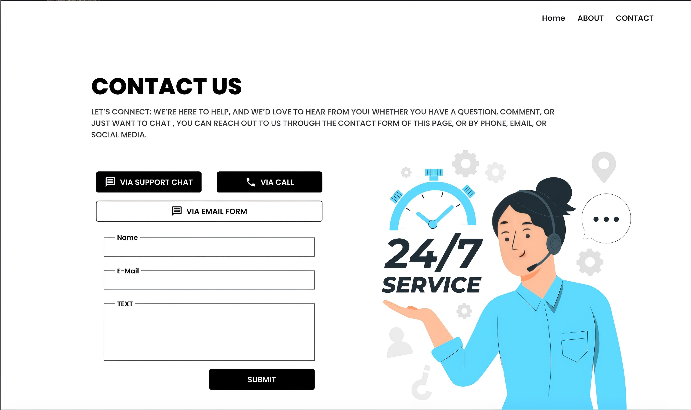

# React Practice Project

This is my second practice project in **React**. The goal of this project is to build a clean and organized webpage using **React components**, **react-icons**. The project also includes usage of **useState hook** to re-render components dynamically.

## 🚀 Project Overview

This React project demonstrates the power of **component-based architecture**. The page is structured using reusable components such as a **Navbar**, **Header**, **Contact Form**, and **Custom Buttons**.

## ✨ Features

1. 📦 Modular components for clean code organization  
2. 🎯 Use of `useState` hook to trigger component re-renders  
3. 🧩 Integration of `react-icons` for icons in buttons and UI    
4. 🧭 Navbar for easy navigation and layout alignment  
5. 🧪 Practiced conditional styling using props (`isOutline` in buttons)

## Screenshots

# Thank you for viewing my project!

